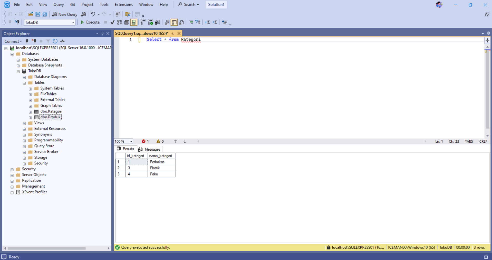

# Project CodeIgniter 4 with SQL Server




## 📋 Prasyarat Sistem

Sebelum menjalankan aplikasi ini, pastikan lingkungan pengembangan kamu sudah memenuhi persyaratan berikut:

### 1. PHP

- Versi PHP minimal: **8.1** (disarankan 8.1 atau lebih baru)
- Pastikan ekstensi berikut sudah aktif:
  - `sqlsrv` (Microsoft Drivers untuk SQL Server)
  - `pdo_sqlsrv`
  - `mbstring`
  - `intl`
  - `openssl`
  - `curl`
- Disarankan menggunakan **XAMPP / Laragon / PHP standalone** yang sudah mendukung ekstensi SQL Server

### 2. SQL Server

- Versi SQL Server minimal: **Microsoft SQL Server 2022 (v21.x)** atau versi terbaru yang kompatibel
- Pastikan SQL Server berjalan dan dapat diakses dari komputer kamu
- Gunakan SQL Server Management Studio (SSMS) untuk import dan manajemen database

### 3. Composer

- Pastikan [Composer](https://getcomposer.org/) sudah terinstall untuk mengelola dependensi CodeIgniter

---

## 🚀 Cara Menjalankan Aplikasi

1. Clone Repository 
```bash
git clone https://github.com/Achareeya-Wicaksa/ci4-sqlserver-test.git
```

2. Install dependencies dengan Composer
```bash
composer install
```
3. Konfigurasi .env
sesuaikan .env.example dengan alamat sql server anda
```bash
database.default.hostname = localhost
database.default.username = sa
database.default.password = passord anda
database.default.database = TokoDB
database.default.DBDriver = SQLSRV
```

## ⚙️ Setup Database

Database utama ada pada file:

```plaintext
database/TokoDB.sql

Cara import database:
Buka SQL Server Management Studio (SSMS)

Masukkan sql pada TokoDB.sql

execute sql.
```

untuk cek apakah db sudah jadi masukan sql 
```bash
USE TokoDB;
GO
SELECT * FROM Kategori;
SELECT * FROM Produk;

```
## Jalankan server built-in ci4
```bash
php spark serve
```
server akan berjalan default di
```bash
http://localhost:8080
```

## 🧰 Fitur utama
- CRUD produk menggunakan SQL Server

- Autentikasi user (jika ada)

- Desain modular dan mudah dikembangkan


```bash
/produk => halaman utama manajemen produk
/produk/create => halaman tambah produk baru
produk/edit/id => edit produk sesuai id
/kategori => halaman utama manajemen kategori
/kategori/create => halaman tambah kategori baru
/kategori/edit/1 => edit kategori sesuai id
```
